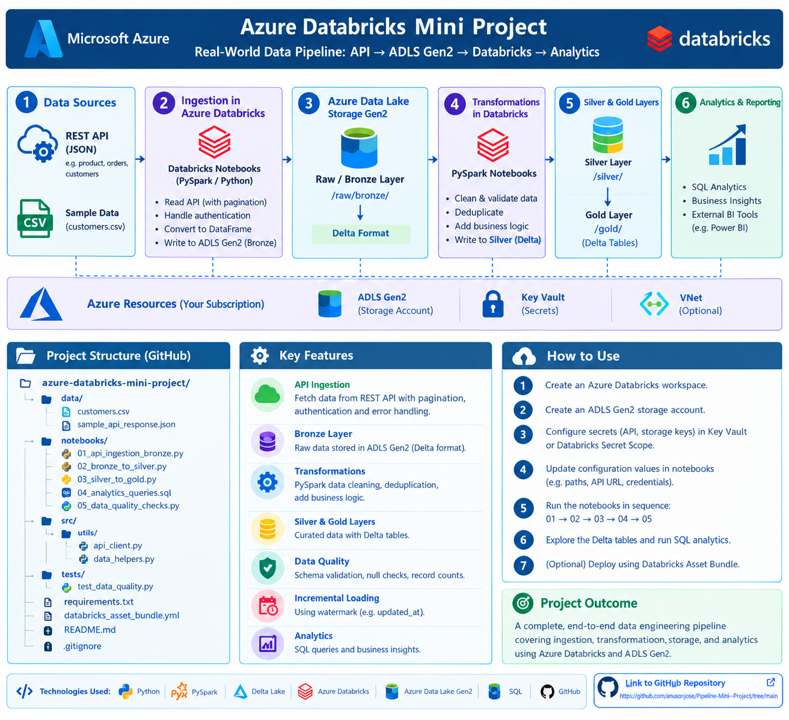

# Azure Databricks Mini Data Engineering Project

A GitHub-ready portfolio project demonstrating an end-to-end Azure data pipeline:

**REST API / CSV → ADLS Gen2 Bronze → Databricks PySpark Silver → Delta Gold → Analytics**

## Business scenario

A retail company receives customer and order data. Orders are loaded incrementally from a REST API and customer reference data from CSV. Databricks cleans, validates, deduplicates, joins and aggregates the data into a daily regional sales summary.

## Architecture

```text
                    +------------------+
                    |   REST Orders API|
                    +---------+--------+
                              |
                              v
                    +------------------+
                    | Azure Databricks  |
                    | Python ingestion  |
                    +---------+--------+
                              |
                    JSON / raw files
                              v
+-------------+      +------------------+
| customers.csv| ---> | ADLS Gen2 Bronze |
+-------------+      +---------+--------+
                              |
                              v
                    +------------------+
                    | Databricks Silver |
                    | PySpark + Delta   |
                    +---------+--------+
                              |
                              v
                    +------------------+
                    | Databricks Gold   |
                    | Delta aggregates  |
                    +---------+--------+
                              |
                              v
                    Power BI / SQL / BI
```

## Project structure

```text
azure-databricks-mini-project/
├── README.md
├── .gitignore
├── requirements.txt
├── config/
│   └── project_config.example.json
├── data/
│   ├── customers.csv
│   └── orders_api_sample.json
├── notebooks/
│   ├── 01_bronze_ingestion.py
│   ├── 02_silver_transform.py
│   ├── 03_gold_aggregation.py
│   └── 04_data_quality_checks.py
├── sql/
│   └── gold_queries.sql
├── tests/
│   └── test_transformations.py
└── databricks.yml
```

## Azure resources

For a real deployment, create:

1. Azure Storage Account with ADLS Gen2 enabled
2. Containers/folders:
   - `bronze`
   - `silver`
   - `gold`
3. Azure Databricks workspace
4. Unity Catalog metastore/catalog/schema
5. Secret scope or Azure Key Vault-backed secret scope
6. Optional Azure Data Factory for orchestration

## Recommended Unity Catalog layout

```text
catalog: retail_dev
schemas:
  bronze
  silver
  gold
```

Example tables:

```text
retail_dev.bronze.orders_raw
retail_dev.silver.orders
retail_dev.silver.customers
retail_dev.gold.daily_region_sales
```

## Data flow

### Bronze
- Fetch API JSON.
- Preserve source payload as close to source format as practical.
- Add ingestion timestamp and source metadata.
- Store as Delta.

### Silver
- Apply schema.
- Cast data types.
- Remove invalid records.
- Deduplicate using `order_id`.
- Join customer reference data.
- Calculate `net_amount`.

### Gold
Create a business-facing aggregate:

```text
order_date
region
order_count
customer_count
total_revenue
average_order_value
```

## Incremental loading

The sample API data contains `updated_at`.

Production pattern:

1. Read the last successful watermark.
2. Request records where `updated_at > watermark`.
3. Write the raw response.
4. Transform and validate.
5. MERGE into the Silver Delta table using `order_id`.
6. Update the watermark only after the pipeline succeeds.

This makes retries safer and prevents missing records.

## Security

Do not commit credentials.

Use Databricks secret scopes / Azure Key Vault and managed identity where appropriate.

Example:

```python
api_token = dbutils.secrets.get(
    scope="retail-project",
    key="api-token"
)
```

Never put real tokens in notebooks or configuration files.

## Running locally

The notebooks are written as Databricks/PySpark notebooks. For a local unit-test run:

```bash
pip install -r requirements.txt
pytest -q
```

## Databricks deployment

The included `databricks.yml` is a starter Databricks Asset Bundle configuration. Adjust workspace paths and catalog/schema names for your environment.

## Interview talking points

- REST API ingestion
- ADLS Gen2
- Databricks and PySpark
- Delta Lake
- Bronze/Silver/Gold architecture
- Incremental loading and watermarking
- MERGE/upsert
- Deduplication
- Data quality
- Idempotent pipeline design
- Secret management
- Git/GitHub integration
- Databricks Asset Bundles
- Optional ADF orchestration

## Production improvements

- API pagination
- Retry with exponential backoff
- API rate-limit handling
- Structured logging
- Quarantine table for rejected records
- Schema evolution controls
- Unity Catalog external locations
- ADF trigger/orchestration
- Job retries and alerts
- CI/CD using GitHub Actions
- Power BI semantic model

## Architecture Diagram


